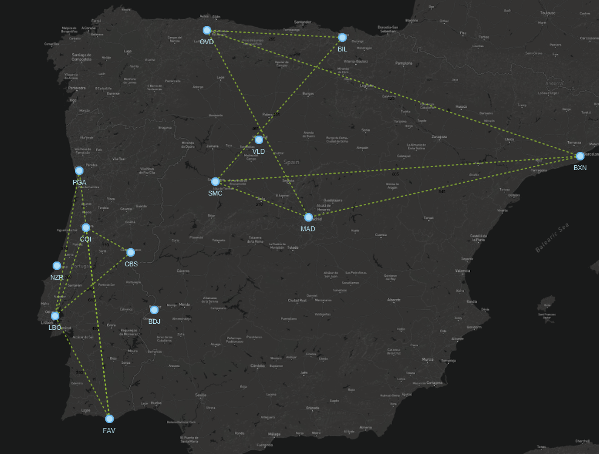

# Projeto PA 2022/23 - Época Normal

O enunciado do projeto encontra-se no Moodle.

Este template *IntelliJ* deve servir de base de desenvolvimento para este trabalho e o seu versionamento interno dentro de cada grupo feito através do *Git*.

## Estrutura de ficheiros/pastas

- `/datasets` - contém os *datasets* a importar pela aplicação
- `/src` - contém o código-fonte da aplicação
    - `com.brunomnsilva.smartgraph` - *package* que contém a biblioteca [JavaFXSmartGraph](https://github.com/brunomnsilva/JavaFXSmartGraph). Não é esperado que tenha de fazer modificações a estas classes.
    - `pt.pa` - *package* principal da aplicação.
        - `*.graph` - *package* que contém o ADT Graph e uma implementação funcional baseada em "lista de arestas";
        - `*.model` - *package* que contém o modelo de classes da aplicação desenvolvida.
        - `*.view` - (a criar) *package* que contém as classes gráficas da aplicação desenvolvida.
    - `Main.java` - classe que contém o ponto de entrada para a aplicação.
- `/test` - (a criar) contém os testes unitários da aplicação
- `smartgraph.css` - *stylesheet* utilizado pela biblioteca JavaFXSmartGraph (pode alterar)
- `smartgraph.properties` - *propriedades* utilizadas pela biblioteca JavaFXSmartGraph (não é necessário alterar, já contém definições adequadas)
- `README.md` - este ficheiro. Podem alterar o conteúdo, se entenderem.

## Dados para importação

Os ficheiros estão em formato de texto, embora possam conter números; poderão existir comentários que começam pelo caráter `"#"` e devem ser ignoradas durante a leitura. Linhas em branco também deverão ser ignoradas. Cada ficheiro terá um cabeçalho indicativo das colunas, imediatamente antes da primeira linha de dados.

Os *datasets* encontram-se na pasta local `datasets`. Portanto, qualquer ficheiro localizado nessa pasta pode ser aberto com, e.g., `new FileReader("dataset/<folder>/<file>.txt")`, sendo `<file>` o ficheiro respetivo a abrir.

Existem três *datasets*:

- **demo** - (13 stops e14 routes);
- **iberia** - (32 stops e 38 routes);
- **europe** - (193 stops e 167 routes).

Cada dataset contem os seguintes ficheiros:

- `stops.txt` - Nomes das cidades onde estão localizadas as paragens de autocarro *stops*;
- `routes-distance.txt` - Lista de percursos  entre  *stops* e respetivas distâncias;
- `routes-duration.txt` - Lista de percursos  entre  *stops* e respetivos tempos;
- `xy.txt` - Coordenadas (de ecrã) das cidades onde estão localizados os *stops*;
- img/{nome-da-imagem}.png - Ficheiro(s) de imagem com possíveis fundos (mapa) a usar pela aplicação.

### Relação da informação entre ficheiros

Não existe qualquer ordem associada aos elementos nos vários ficheiros do dataset.  A relação entre as várias linhas de dados é feita usando o código da paragem (**stop_code**). 

### Exemplo de modelo importado

A título de exemplo, mostra-se o resultado esperado da importação dos *datasets*

### demo

### iberian

### europe

### Primeiro milestone:
- Foi realizada a implementação de um grafo com a estrutura de dados "lista de adjacências".
- Foram implementados os seguintes métodos correspondentes à lista de adjacências:
  - areAdjacent(Vertex<V> orginV, Vertex<V> destinationV) throws InvalidVertexException - retorna uma exceção
  executada no checkVertex, que será lançada caso o vértice seja null, se não for um vértice ou se o vértice não pertença ao gráfico; 
  este método determina se os vértices são adjacentes ou não.
  - numVertices() - determina o número de vértices que existem no grafo.
  - numEdges() - determina o número de arestas que existem no grafo.
  - vertices() - retorna os valores dos vértices, numa coleção.
  - existsVertexWith(V element) - determina se existe um vértice com um elemento passado por argumento; retorna true se o elemento
  já existe ou false caso o elemento não exista.
  - existsEdgeWithElement(E element) - determina se existe uma aresta com um elemento passado por argumento; retorna true 
  caso o elemento já exista ou falso caso o elemento não exista.
  - edges() - retorna os valores das arestas, numa coleção.
  - incidentEdges(Vertex<V> v) - retorna as arestas incidentes de um vértice, numa coleção.
  - opposite(Vertex<V> v, Edge<E, V> e) throws InvalidVertexException, InvalidEdgeException - 
  a primeira exceção é lançada caso a aresta não pertença ao vértice, a segunda exceção é executada no método checkVertex,
  que será lançada caso o vértice seja null, se não for um vértice ou se o gráfico não pertença ao gráfico; retorna o vértice oposto
  ou null.
  - insertVertex(V vElement) throws InvalidVertexException - a exceção é lançada caso o vértice que é adicionado seja null ou se já houver
  um vértice o elemento dado (passado por parâmetro); retorna o vértice inserido.
  - insertEdge(Vertex<V> origin, Vertex<V> destination, E edgeElement) throws InvalidVertexException, InvalidEdgeException - 
  a primeira exceção é lançada caso a aresta não pertença ao vértice, a segunda exceção é executada no método checkVertex,
  que será lançada o vértice seja null, se não for um vértice ou se o gráfico não pertença ao gráfico, a segunda exceção é lançada
  caso a aresta a ser adicionada seja null ou se já existe uma aresta com a chave dada; retorna a aresta inserida.
  - insertEdge(V vElement1, V vElement2, E edgeElement) throws InvalidVertexException, InvalidEdgeException - a primeira exceção é lançada
  caso não exista um vértice com o elemento passado por parâmetro, a segunda exceção é lançada caso
  a aresta a ser adicionada seja null ou se já existe uma aresta com a chave; retorna a aresta inserida.
  - removeVertex(Vertex<V> v) throws InvalidVertexException - a exceção é testada no método checkVertex e será lançada
  caso o vértice seja null, se não for um vértice ou se o gráfico não pertença ao gráfico; retorna o elemento removido.
  - removerEdge(Edge<E, V> e) throws InvalidEdgeException - a exceção é testada no método checkVertex
  e será lançada caso o vértice seja null, se não for um vértice ou se o gráfico 
  não pertença ao gráfico; retorna a aresta removida.
  - replace(Vertex<V> v, V newElement) throws InvalidVertexException - a exceção é lançada caso o elemento passado por parâmetro seja null, o vértice seja null,
  não for um vértice ou caso o vértice não pertença ao grafo; retorna o elemento a ser substituído.
  - replace(Edge<E, V> e, E newElement) throws InvalidEdgeException - a exceção é lançada caso a aresta não exista, caso a aresta seja null, não seja uma aresta
  ou a aresta não pertença ao grafo; retorna o elemento a ser substituído.

- Dentro da classe que implementa a lista de adjacências, também foram implementadas as inner classes MyVertex e MyEdge.
- A inner classe MyVertex implementa a classe Vertex<V>, inicializa os atributos element do tipo V (vertice) e as incidentEdges no construtor,
cria os métodos element() que retorna o elemento de um vértice e toString() de modo a aparecer ao utilizador, a forma como queremos que a constituição do vértice apareça.
- A inner classe MyEdge implementa a casse Edge<E>, inicializa o atributo element do tipo E (aresta) no construtor,
cria os métodos element() que retorna o elemento de uma aresta e toString() de modo a aparecer ao utilizador, a forma como queremos que a constituição do vértice apareça.
- Foi criada uma classe ImportaDatasets responsável por importar informação para um grafo implementado com lista de adjecências que utiliza Stops como Vertices e Routes como Edges.
- Dentro desta classe existem os seguintes métodos:

- Definimos Routes e Stops, de acordo com a informação que foi importada.
- A classe Main foi alterada de forma a podermos visualizar o grafo com o JavaFX, com os diferentes tipos de fundo disponíveis.
- Finalmente, foram criados mockups da interface gráfica idealizada para o projeto.

## Segundo Milestone
- Em relação ao primeiro milestone, foram melhoradas as classes de importação: criámos 4 classes sendo que ImportData corresponde à importação 
dos datasets; ImportToGraph corresponde à importação dos stops, routes e ainda o load dos mesmos para o grafo; InvalidDatasetException no caso
de o dataset for inválido; StopsNotLoadedException no caso de os stops não conseguirem ser carregados para o grafo. Estas melhorias englobam
o ponto 3.1.1 uma vez que é pedido que realizemos a importação da rede logística.

- Abaixo apresentamos as classes utilizadas em cada ponto pedido no enunciado bem como os métodos que estão contidos nas mesmas.
- Em relação às classes e packages que utilizámos no cumprimento do que é pedido no enunciado, 
estão enunciados os métodos presentes em cada classe, de cada package, com os seus atributos.
- Em relação aos testes, estão enunciados os que foram feitos bem como os packages onde pertencem.
- Por fim, serão apresentados os mockups melhorados bem como os novos que decidimos criar da aplicação.

## 3.1.1 Importação e visualização da rede logística

### ImportData
  - public static ArrayList<String> listAvailableDatasets()
  - public static Image loadImage(String filePath) throws IOException
  - public static ArrayList<String> getDataFromFile(String filename) throws IOException
  - public static Map<String, Stop> loadStopsToMap(String dataset) throws InvalidDatasetException
  - public static Map<Pair<String, String>, Route> loadRoutesToMap(String dataset) throws InvalidDatasetException
  - public static Map<Pair<String, String>, Integer> loadRoutesPropertiesToMap(String filename) throws InvalidDatasetException
  - public static Map<String, Pair<Integer, Integer>> loadStopsPosition(String dataset) throws InvalidDatasetException
  - private static boolean isNumeric(String string)

### ImportToGraph
  - public ImportToGraph(String dataset, Graph<Stop, Route> graph)
  - public void importRoutes() throws InvalidDatasetException
  - public Map<String, Vertex<Stop>> importStops() throws InvalidDatasetException
  - public Map<String, Vertex<Stop>> loadStopsToGraph() throws InvalidDatasetException
  - public Map<Pair<String, String>, Edge<Route, Stop>> loadRoutesToGraph() throws StopsNotLoadedException, InvalidDatasetException
  - public int size()
  - public Graph<Stop, Route> getNetwork()
  - public Vertex<Stop> findStop(String stopName)
  - public boolean existStop(String stopName)
  - public void addStop(String stopCode, String stopName, int latitude, int longitude) throws StopInvalidOperation
  - public void removeStop(String stopName) throws StopInvalidOperation
  - public Edge<Route, Stop> findRoute(String initialStop, String destination) throws RouteInvalidOperation
  - public boolean existRoute(String initialStop, String destination) throws RouteInvalidOperation
  - public Edge<Route, Stop> addRoute(String initialStop, String destination, int distance, int duration) throws RouteInvalidOperation
  - public Edge<Route, Stop> removeRoute(String initialStop, String destination) throws RouteInvalidOperation
  - private void addEdgeToMap(String initialStop, String destination, Edge<Route, Stop> edge)
  - private void removeEdgeFromMap(Edge<Route, Stop> edge)
  - private void addVertexToMap(String stopCode, Vertex<Stop> vertex)
  - private void removeVertexFromMap(Vertex<Stop> vertex)
  - public Map<String, Vertex<Stop>> getVertexMap()
  - public Map<Pair<String, String>, Edge<Route, Stop>> getEdgesMap()
  - public List<String> getStopNames()
  - public DijkstraResult<Stop, Route> shortestPathBetweenTwoStops(String initialStop, String endStop) throws StopInvalidOperation
  - public List<Vertex<Stop>> stopsWithinNRoutes(Vertex<Stop> stop, int max)
  - private List<Vertex<Stop>> getVisitedV(Queue<Vertex<Stop>> queue, int initialLvl, int max, List<Vertex<Stop>> visitedV)

## 3.1.2 Cálculo de métricas

### GraphMetrics
  - public static List<Map.Entry<Stop, Integer>> adjacencyOrdered(Graph<Stop, Route> graph)
  - private static Map<Stop, Integer> getVertexWithAdjacencyValueMap(Graph<Stop, Route> graph)
  - private static List<Map.Entry<Stop, Integer>> getOrderedMapByValue(Map<Stop, Integer> map)
  - public static int numberGraphComponents(Graph<Stop, Route> graph)
  - private static HashSet<Vertex<Stop>> dfs(Graph<Stop, Route> graph, Vertex<Stop> vRoot)

## 3.1.3 Adição e remoção de rotas e disponibilização da funcionalidade de Undo

### RouteManagerController
  - public RouteManagerController(NetworkRouteManagerView view, ImportToGraph model)
  - public Edge<Route, Stop> doAddRoute()
  - public Edge<Route, Stop> doRemoveRoute()

### CommandAdd
  - public CommandAdd(RouteManagerController controller, ImportToGraph model)
  - public void execute()
  - public void undo()

### CommandRemove
  - public CommandRemove(RouteManagerController controller, ImportToGraph model, String iStop, String eStop)
  - public void execute()
  - public void undo()

### CommandsUsed
  - public void push(Command c)
  - public Command pop()
  - public boolean isEmpty()

## 3.1.4 Exportação de um novo dataset

### ExportGraphToDataset
- Conta com uma classe de exceção chamada DatasetAlreadyExistException.
  - public ExportGraphToDataset(GraphDisplay graphDisplay, String outputName)
  - private Map<Stop, Pair<Integer, Integer>> vertexPositionToMap()
  - private ArrayList<String> vertexPositionToData()
  - private String exportStopsPositionToString()
  - private ArrayList<String> vertexToData()
  - private String exportStopsToString()
  - private boolean createParentFolder()
  - private void exportStopsToDataset()
  - private void exportStopsXYtoDataset()
  - private void copyImagesToDataset()
  - private ArrayList<String> getFilesInImages()
  - private void copyImage(String imageName) throws IOException
  - private String exportRouteDistanceToString()
  - private String exportRouteDurationToString()
  - private void exportRoutePropertyToDataset(String type)
  - private ArrayList<String> routePropertyToList(String type)
  - public void exportGraphToDataset() throws DatasetAlreadyExistException

## 3.1.5 Cálculo de caminhos mais curtos entre um par de stops

### DijkstraResult
  - public DijkstraResult(int cost, List<Vertex<V>> path)
  - public DijkstraResult(int cost, List<Vertex<V>> path, List<Edge<E, V>> pathEdges)
  - public int getCost()
  - public List<Vertex<V>> getPath()
  - public boolean hasSolution()
  - public List<Edge<E, V>> getPathEdges()
  - public String toString()
  - public static DijkstraResult<Stop, Route> minimumCostPath(Graph<Stop, Route> graph, Vertex<Stop> start, Vertex<Stop> destination)
  - public static void dijkstra(Graph<Stop, Route> graph, Vertex<Stop> start, Map<Vertex<Stop>, Integer> distances,
    Map<Vertex<Stop>, Vertex<Stop>> predecessors, Map<Vertex<Stop>, Edge<Route, Stop>> edgePredecessors)
  - private static Vertex<Stop> findMinCostVertex(Map<Vertex<Stop>, Integer> distances, List<Vertex<Stop>> unvisited)
  - public static DijkstraResult<Stop, Route> mostDistantVerticesInGraph(Graph<Stop, Route> graph)
  - public static String getDuration(DijkstraResult<Stop, Route> result)

## 3.1.6 Par de paragens mais distante
## 3.1.7 Paragens (stops) que distam N rotas da paragem P
- Estes dois pontos presentes no enunciado encontram-se na mesma classe, referida abaixo.

### CalculateTravelController
- Esta classe para além de permitir que o utilizador possa interagir com a janela Calculate Travel, permite obter o número de paragens que distam
N rotas da paragem P, por isso serão apresentados todos os seus métodos.
- Permite ainda guardar em pdf e mudar a estratégia utilizada.
  - public CalculateTravelController(ImportToGraph model, NetworkCalculateTravelView view)
  - public void doShortestPath()
  - public void doMostDistantStopsPath()
  - public void doStopsWithinNRoutes()
  - public void doSaveToPDF()
  - public void changeStrategy(Strategy strategy)

## 3.1.8 Geração de bilhetes

### CompleteFormat (implementa a interface Ticket)
  - public CompleteFormat(DijkstraResult result, String saveName)
  - public String getDuration(DijkstraResult result)
  - private int getNumStops(DijkstraResult result)
  - private String formattedPath(DijkstraResult result)

### IntermediateFormat (implementa a interface Ticket)
  - public IntermediateFormat(DijkstraResult result, String saveName)
  - private String formattedPath(DijkstraResult result)
  - public String getDuration(DijkstraResult result)

### SimpleFormat (implementa a interface Ticket)
  - public SimpleFormat(DijkstraResult result, String saveName)
  - public String getDuration(DijkstraResult result)
  - private int getNumStops(DijkstraResult result)

### TicketFactory
  - public static Ticket create(String format, DijkstraResult<Stop, Route> result, String saveName)

### Ticket (interface)
  - String getDuration(DijkstraResult result);

## Estratégias utilizadas:
  
### CalculateDistanceStrategy
- public String compute(DijkstraResult<Stop, Route> result)

### CalculateDurationStategy
- public String compute(DijkstraResult<Stop, Route> result)

### Stategy (interface)
- String compute(DijkstraResult<Stop, Route> result);

## Componentes do grafo

### GraphComponents
  - public GraphComponents(String dataset)
  - public void initComponents() throws InvalidDatasetException
  - public Graph<Stop, Route> getGraph()
  - public String getDataset()
  - public Map<String, Vertex<Stop>> getVertexMap()
  - public ImportToGraph getModel()
  - public void setGraph(Graph<Stop, Route> graph)
  - public void setDataset(String dataset)
  - public Map<Pair<String, String>, Edge<Route, Stop>> getEdgeMap()

## Graph View Handler - mudanças do display do grafo (package)

### BackgroundType
  - public String toString()
  - public String getVertexLabelStyle()

### GraphViewHandler
  - public static void loadDefaultStopsPositionToGraphView(SmartGraphPanel<Stop, Route> graphView, GraphComponents graphComponents) throws InvalidDatasetException
  - public static void changeVertexLabel(GraphDisplay graphDisplay)
  - public static Background changeBackground(GraphComponents graphComponents, BackgroundType backgroundType)
  - private static Image loadImageFile(String filePath)
  - private static Background createBackground(Image image)

### InvalidBackgroundType (extends Exception)
  - public InvalidBackgroundType()
  - public InvalidBackgroundType(String string)

## Model

### AutoCompleteText
  - public AutoCompleteText()
  - public SortedSet<String> getEntries()
  - private void populatePopup(List<String> searchResult)

### Route
  - public Route(int distance, int duration)
  - public int getDistance()
  - public int getDuration()
  - public String toString()

### Stop
  - public Stop(String stopCode, String stopName, double latitude, double longitude)
  - public String getStopCode()
  - public String getStopName()
  - public double getLatitude()
  - public double getLongitude()
  - public String toString()
  - public String toStringDetails()

## Observer

### Observable (interface)
  - public void addObservers(Observer observers);
  - public void removeObservers(Observer observer);
  - public void notifyObservers(Object object);

### Observer (interface)
  - void update(Observable subject, Object obj);

### Subject (implementa Observable)
  - public Subject()
  - public void addObservers
  - public void removeObservers(Observer observer)
  - public void notifyObservers(Object obj)

## View

### Main Menu (package)

### DatasetLoaderPanel

- public DatasetLoaderPanel()
- private void drawCenter()
- private VBox drawContent()
- private VBox drawLabels()
- private Button drawLoadButton(ComboBox<String> comboBox)
- private void setLoadButtonAction(ComboBox<String> comboBox)
- private void setButtonBackground(Button button, String color)
- private ComboBox<String> drawComboBox()
- private void initGraphDisplay(String dataset)
- private void sendAlert()

### ExportDatasetPanel

- public ExportDatasetPanel(GraphDisplay graphDisplay)
- private void drawCenter()
- private HBox drawTextBox()
- private void confirmAction(String datasetName)
- private void sendAlert(String title, String header)

### GraphDisplay
- public GraphDisplay(String dataset)
- private void initGraphView()
- public void initContentDisplay()
- public void changeBackground(BackgroundType backgroundType)
- public void updateBackground()
- public void setPositionsOfVertex()
- public SmartGraphPanel<Stop, Route> getGraphView()
- public void setGraphView(SmartGraphPanel<Stop, Route> graphView)
- private void updateContent()
- public GraphComponents getGraphComponents()
- public void init()
- public void changeToTravelScreen()
- public void changeToManagerScreen()
- public BackgroundType getCurrentBackground()
- public void update()

### GraphDisplayRightPanel
- public GraphDisplayRightPanel(GraphDisplay graphDisplay)
- private void drawRight()
- private VBox drawRightButtons()
- private void setTravelOnClickAction()
- private Button drawButton(String text)
- private void setManageOnClickAction()
- public static Button drawReturnMenuButton()
- private void setMetricsOnClickAction()
- private void sendAlert()

### SidePanelStopsStats
- public SidePanelStopStats(ImportToGraph model)
- public Label getLabelNumberStops()
- public Label getLabelNumRoutes()
- private void createStopPanel()
- private void createRoutePanel()
- private void inicializePane(GridPane pane)

### TopMenuBar
- public TopMenuBar(GraphDisplay graphDisplay)
- private void drawMenus()
- private Menu drawFileMenu()
- private MenuItem drawChangeDatasetMenu()
- private Menu drawViewMenu()
- private Menu drawChangeBackgroundMenu()
- private void changeBackground(BackgroundType backgroundType)

### Metrics (package)

### MetricsPane
- public MetricsPane(GraphDisplay graphDisplay)
- private void drawTop()
- private void drawBottom()
- private void setBackOnClickAction()
- private void drawLeft()
- private VBox drawMetrics()
- private void drawCenter()
- private void drawRight()
- private BarChart<String, Number> drawBarChart(List<Map.Entry<Stop, Integer>> list)
- private VBox drawStopsAdjacency()
- private HBox drawLine(String key, String value)

### StopsListView
- public StopsListView(List<Map.Entry<Stop, Integer>> entries)
- private Node drawCell(Map.Entry<Stop, Integer> entry)

### RouteManage (package)

### NetworkRouteManagerUI (interface) extends Observer
- String getRouteDurationAdd();
- String getRouteDistanceAdd();
- String getInitialStopNameAdd();
- String getEndStopNameAdd();
- void displayError(String msg);
- void clearError();
- void clearControls();
- void clearGraphStyle();
- void setTriggers(RouteManagerController controller);
- void update(Observable subject, Object arg);

### NetworkRouteManagerView
- public NetworkRouteManagerView(GraphDisplay graphDisplay, ImportToGraph model, SmartGraphPanel<Stop, Route> graphPanel)
- public String getRouteDistanceAdd()
- public String getInitialStopNameAdd()
- public String getEndStopNameAdd()
- public String getRouteDurationAdd()
- public void setTriggers(RouteManagerController controller)
- private void executeCommand(Command command)
- private void undo()
- public void displayError(String msg)
- public void clearError()
- public void clearControls()
- public void clearGraphStyle()
- private void createLayout()
- private VBox createSidePanel()
- public void setFields()
- public void update(Observable subject, Object arg)

### NetworkViewCreator
- private NetworkViewCreator()
- public static NetworkViewCreator getInstance()
- public void createLayout(BorderPane networkView, SmartGraphPanel<Stop, Route> graphPanel, VBox sidePanel, Label error)

### RouteInvalidOperation extends Exception
- public RouteInvalidOperation()
- public RouteInvalidOperation(String message)

### StopInvalidOperation extends Exception
- public StopInvalidOperation()
- public StopInvalidOperation(String message)

### TravelManage (package)

### CalculateTravelUI
- String getShortestInitalStopNameAdd();
- String getShortestEndStopNameAdd();
- String getNDistanceInitialStopName();
- String getNDistanceStopsMaxNumber();
- void displayError(String msg);
- void clearError();
- void clearControls();
- void clearGraphStyle();
- void setTriggers(CalculateTravelController controller);

### GraphNotLoadedException extends Exception
- public GraphNotLoadedException()
- public GraphNotLoadedException(String message)

### NetworkCalculateTravelView extends BorderPane implements CalculateTravelUI, Observer
- public NetworkCalculateTravelView(GraphDisplay mainScreen, ImportToGraph model, SmartGraphPanel<Stop, Route> graphPanel)
- public String getShortestInitalStopNameAdd()
- public String getShortestEndStopNameAdd()
- public String getNDistanceInitialStopName()
- public String getNDistanceStopsMaxNumber()
- public SmartGraphPanel<Stop, Route> getGraphPanel()
- public Label getLblShortestPathCost()
- public Label getLblNDistanceStopsCount()
- private void createLayout()
- private VBox createSidePanel()
- private void setFields()
- private HBox createStrategySelect()
- private HBox createUserInterfaceBox(Rectangle rectangle, Label firstLabel, Label secondLabel)
- private void setStyles(Label label)
- public void initGraphDisplay()
- public void update(Observable subject, Object arg)
- public void displayError(String msg)
- public void clearError()
- public void clearControls()
- public void clearGraphStyle()
- public void setTriggers(CalculateTravelController controller)

### SaveToPDFPanel extends BorderPane
- public SaveToPDFPanel(DijkstraResult<Stop, Route> dijkstraResult)
- private void drawCenter()
- private HBox drawComboBox()
- private void setTriggers()
- private boolean checkText()
- private HBox drawTextBox()
- private void sendAlert(String title, String header, Alert.AlertType type)

## Testes

### DijkstraResultTest
  - void getCost()
  - void getPath()
  - void hasSolution()
  - void getPathEdges()
  - void testToString()
  - void test_furthest_apart()

### GraphAdjacencyListTest
- Aqui estão inseridos também os restantes testes que nos faltavam no primeiro milestone e que fomos aconselhados a fazer, por parte do docente.
  - public void insertVertex_throwsException_ifVertexExists()
  - public void insertEdge_throws_InvalidEdgeException_ifEdge_IsNullOrExists()
  - public void opposite_isOK()
  - public void areAdjacent_isOK()
  - public void numVertices_isOK()
  - public void numEdges_isOK()
  - public void vertices_isNotNull()
  - public void edges_isNotNull()
  - public void incidentEdges_isOK()
  - public void insertEdge_throws_InvalidEdgeException_ifAnEdgeAlreadyExists_secondMethod()
  - public void removeVertex_isOK()
  - public void removeEdge_isOK()
  - public void replace_throws_InvalidVertexException_ifNewElementIsNull()
  - public void replace_throws_InvalidEdgeException_ifEdgeDoesNotExist()

### ImportDataTest
  - void getDataFromFile_Test()
  - void loadStopsToMap_Test()
  - void loadRoutesDurationToMap_Test()
  - void loadRoutesDistanceToMap_Test()
  - void loadRoutesToMap_Test()
  - void loadStopsPosition_Test()

### ImportToGraphTest
  - void loadStopsToGraph_Test()
  - void loadRoutesToGraph_ThrowsException_WhenStationsNotLoaded()
  - void loadRoutesToGraph_Test()
  - void test_find_routes()
  - void test_find_stops()

### GraphMetricsTest
  - public void test_adjacency_ordered()
  - void test_number_of_graph_components()

### TicketFactoryTest
  - void createSimpleIsOk()
  - void createIntermediateIsOk()
  - void createCompleteIsOk()
  - void getDurationIsOk()

# Refactoring
- Foram apenas encontrados 4 code smells todos do mesmo tipo Long Method, e foram todos resolvidos da mesma
maneira, através do Extract Method.
- Estavam presentes na classe ImportToGraph, NetworkRouteManagerView, NetworkCalculateTravelView, e ExportGraphToDataset.
- Os mesmos foram corrigidos e o README.md foi corrigido conforme as alterações efetuadas.

### Mockup Antigo - inicial

### Mockups Finais - novos e melhorados

